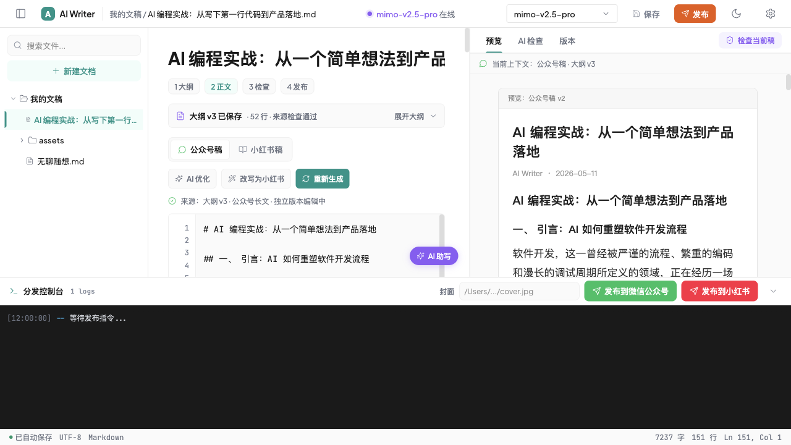
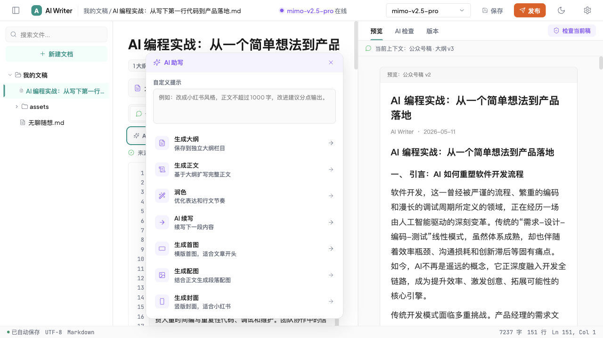
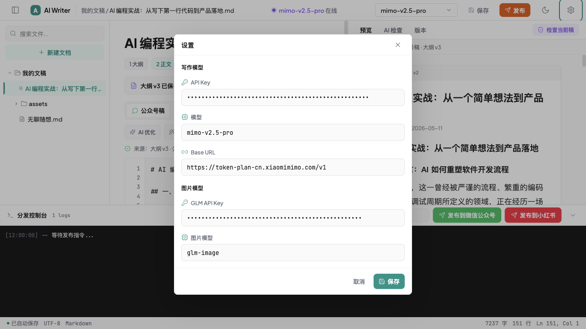

# AI Publisher

AI Publisher 是一个面向内容创作者的本地写作与多平台分发工作台。它把 Markdown 文稿管理、AI 助写、图片生成、公众号/小红书双平台草稿、发布检查和小红书 RPA 放在同一个界面里，适合维护从选题到发布的完整内容生产流程。



## 核心能力

- 本地文稿管理：扫描本机 Markdown 文稿目录，支持创建、读取、保存、重命名、删除和自动保存。
- 大纲与正文分离：同一篇文章保留独立大纲区，正文生成和后续改写都能复用大纲上下文。
- 双平台草稿：同一篇内容可维护「公众号稿」和「小红书稿」两个独立版本。
- AI 助写：支持生成大纲、生成正文、润色、续写，以及根据当前正文生成首图、配图、封面。
- AI 检查：针对当前平台做本地规则检查和模型辅助检查，识别标题长度、正文长度、敏感词和平台风险。
- 小红书格式化：发布前把 Markdown 转成小红书纯文本，去掉 Markdown 图片/链接/加粗语法，改成换行、符号和短段落排版。
- 分发控制台：集中管理封面路径、公众号发布入口、小红书 RPA 发布任务和执行日志。
- 小红书 RPA：用 Playwright 打开创作者后台，复用登录态，填充标题、正文和封面，最后停在人工确认步骤。
- 本地配置持久化：模型 API Key、Base URL、模型名等配置保存到 SQLite。

## 功能截图

### 写作工作台

左侧是本地文稿树，中间是带行号的编辑区，右侧是预览、AI 检查和版本视图。底部状态栏会显示保存状态、字数和当前行数。


### AI 助写与图片生成

AI 助写面板支持自定义提示，也提供常用动作：生成大纲、生成正文、润色、续写、生成首图、生成配图和生成小红书封面。



### 分发控制台

发布入口会打开分发控制台：公众号侧保留发布入口，小红书侧会要求提供封面图路径并启动 RPA。控制台实时展示任务日志，方便知道流程停在登录、上传、填写还是人工确认阶段。


### 模型设置

设置弹窗用于配置写作模型和图片模型。写作模型支持 OpenAI-compatible Base URL；图片生成当前使用 GLM 配置，并由后端保存到本地资产目录。



## 小红书内容格式

小红书正文不是 Markdown 渲染场景。项目内部可以继续用 Markdown 保存草稿，但发布和 RPA 前会转换成小红书纯文本：

- `# 标题` 会去掉 Markdown 标记。
- `## 小标题` 会转成 `📌 小标题`。
- `- 列表` 会转成 `• 列表`。
- `1. 步骤` 会转成 `① 步骤`、`② 步骤`。
- `**重点**`、`` `代码` ``、`[链接](url)` 会保留可读文字，去掉 Markdown 语法。
- `` 不进入正文，图片由封面/资产上传流程处理。
- 多余空行会合并，最终正文更接近小红书移动端阅读习惯。

前端转换器位于 `frontend/src/app/formatters/xhs.ts`，后端 RPA 也会通过 `backend/src/main/java/com/aiwriter/rpa/XhsContentFormatter.java` 再兜底转换一次。

## 技术栈

- Frontend: React 18, TypeScript, Vite 6, Tailwind CSS 4, Radix UI, lucide-react
- Backend: Java 21, Spring Boot 3.4, JDBC, SQLite
- AI: LangChain4j, OpenAI-compatible Chat API, Anthropic-compatible endpoint, Z.AI/GLM image generation
- RPA: Playwright for Java
- Spec workflow: OpenSpec

## 项目结构

```text
.
├── backend/                  # Spring Boot API 服务
│   ├── src/main/java/com/aiwriter/
│   │   ├── ai/               # AI 网关、模型客户端、图片客户端
│   │   ├── controller/       # REST API
│   │   ├── model/            # 请求/响应 DTO
│   │   ├── rpa/              # 小红书 Playwright 自动化
│   │   └── service/          # 文稿、配置、AI、图片服务
│   └── src/main/resources/application.yml
├── frontend/                 # Vite React 应用
│   └── src/app/              # 页面、组件、formatter 和 API client
├── docs/screenshots/         # README 功能截图
├── openspec/                 # 需求变更与规格说明
└── docs/                     # 设计/实施计划文档
```

## 环境要求

- Java 21+
- Maven 3.9+
- Node.js 20+ 或 22+
- pnpm 9+ 或 npm
- 小红书 RPA 需要本机可启动 Chromium/Chrome

## 快速启动

### 1. 启动后端

```bash
cd backend
mvn spring-boot:run
```

后端默认监听 `http://localhost:8080`。

首次运行会初始化：

- 数据目录：`~/.ai-publisher`
- 文稿目录：`~/wiki/AI Writer`
- SQLite 配置库：`~/.ai-publisher/config.db`
- 图片资产目录：`~/.ai-publisher/assets`

### 2. 启动前端

```bash
cd frontend
pnpm install
pnpm dev
```

前端默认监听 `http://localhost:5173`，并通过 Vite proxy 转发 `/api` 到 `http://localhost:8080`。

## 配置项

应用内「设置」会通过 `/api/v1/settings` 写入本地 SQLite。

| Key | 说明 | 默认值 |
| --- | --- | --- |
| `ai_api_key` | 写作模型 API Key | 空 |
| `ai_base_url` | 写作模型 Base URL | `https://api.deepseek.com` |
| `selected_model` | 写作模型名 | `deepseek-chat` |
| `image_provider` | 图片生成 provider | `zai` |
| `image_api_key` | 图片模型 API Key | 空 |
| `zai_api_key` | Z.AI/GLM 图片生成 Key | 空 |
| `bigmodel_api_key` | 兼容旧配置的 GLM Key | 空 |
| `image_model` | 图片模型名 | `glm-image` |
| `image_quality` | 图片质量 | `2k` |

`application.yml` 中可调整本地路径和端口：

```yaml
server:
  port: 8080

app:
  data-dir: ${user.home}/.ai-publisher
  articles-dir: ${user.home}/wiki/AI Writer
```

## 常用命令

后端：

```bash
cd backend
mvn test
mvn spring-boot:run
```

如只跑非浏览器单测，可跳过 Playwright 安装钩子：

```bash
cd backend
mvn -Dexec.skip=true -Dtest=XhsContentFormatterTest test
```

前端：

```bash
cd frontend
pnpm install
pnpm dev
pnpm build
pnpm preview
```

## API 摘要

所有接口统一返回：

```json
{
  "code": 200,
  "message": "ok",
  "data": {}
}
```

主要接口：

- `GET /api/v1/files`：列出文稿树
- `GET /api/v1/files/content?path=...`：读取文稿内容
- `POST /api/v1/files/save`：保存文稿
- `POST /api/v1/files/create`：创建文稿
- `DELETE /api/v1/files?path=...`：删除文稿
- `POST /api/v1/files/rename`：重命名文稿
- `GET /api/v1/settings`：列出设置
- `POST /api/v1/settings`：保存设置
- `POST /api/v1/ai/generate`：AI 助写
- `POST /api/v1/ai/image`：AI 图片生成
- `POST /api/v1/ai/check`：发布前检查
- `GET /api/v1/assets/**`：读取本地图片资产
- `POST /api/v1/rpa/jobs`：启动小红书 RPA 草稿准备
- `GET /api/v1/rpa/jobs/{jobId}`：查询 RPA 任务状态
- `GET /api/v1/rpa/jobs/{jobId}/logs`：读取 RPA 日志
- `POST /api/v1/rpa/jobs/{jobId}/confirm`：确认点击发布

## 小红书 RPA 注意事项

小红书发布是半自动流程：系统会打开浏览器、复用/保存登录态、填入图文内容，但不会自动越过人工确认。用户需要检查页面内容后，再在应用中确认发布。

- 登录态保存到 `~/.ai-publisher/rpa-session/xhs-state.json`
- 图文发布需要提供封面图路径
- RPA 接口收到 Markdown 时会先转换成小红书纯文本
- 首次运行 Playwright 可能会下载 Chromium
- 小红书后台 DOM 可能变化，选择器失效时需要更新 `backend/src/main/java/com/aiwriter/rpa/XhsRpaPublisher.java`

## 当前阶段

仓库中已有 MVP 变更记录：

- `phase1-backend-foundation`：文件管理、配置持久化和 API 基础。
- `mvp1-real-ai-assist`：真实 AI 助写链路。
- `mvp2-publish-preflight`：发布前检查和半自动导出。
- `mvp3-xhs-rpa-spike`：小红书 RPA 技术验证与集成。
